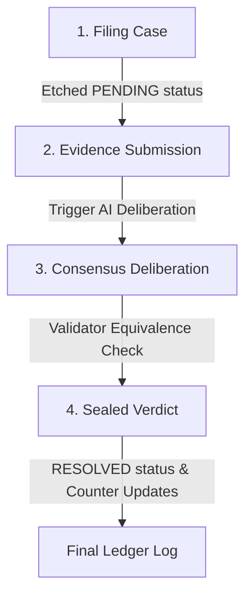

# Genacle: The On-Chain Autonomous Court

Genacle is a decentralized AI arbitration tribunal built entirely on-chain on GenLayer. It provides an autonomous legal protocol to resolve natural-language contract disputes through validator consensus, eliminating central intermediaries and escrow custody risks.

Genacle is currently sitting live at [k-beee.github.io/genacle](https://k-beee.github.io/genacle/), reading and writing to contract [`0xd23D6E…5ACe`](https://explorer-bradbury.genlayer.com/address/0xd23D6E7688942FeB5e58aca3f5700b98921E5ACe) on GenLayer Bradbury.

---

## 1. Protocol Architecture & Workflow

Genacle operates as an autonomous dispute resolution lifecycle that transitions through four distinct phases:



### I. Case Filing
Either party files a new dispute by invoking `file_dispute(title, agreement, claimant_case, respondent_case)`. The contract validates input lengths, increments the sequence counter, sets the state to `PENDING`, and logs the action to the append-only event ledger.

### II. Settlement Evidence
When evidence becomes available (e.g. telemetry logs, code snippets, or API responses), anyone can submit it to `resolve_dispute(dispute_id, evidence)` to trigger the autonomous AI deliberation.

### III. Consensus Deliberation
A leader validator runs the evaluation prompt. Every other validator in the GenLayer network independently re-runs the prompt to verify the leader's proposed verdict, ensuring decentralized judgment.

### IV. Sealed Verdict
If validators reach consensus, the verdict (`CLAIMANT_WIN`, `RESPONDENT_WIN`, or `DISMISSED`) is etched on-chain, updating statistics, and the status changes to `RESOLVED`.

---

## 2. Technical Specification

### Smart Contract (`contracts/genacle.py`)
The tribunal state is managed using GenLayer storage structures optimized to prevent high-gas loops:
* **disputes**: A `TreeMap[str, str]` storing serialized JSON case records keyed by a sequence ID.
* **dispute_ids**: A parallel `DynArray[str]` storing insertion order for paginated view methods.
* **ledger**: An append-only `DynArray[str]` logging historical court actions.
* **Global Statistics**: `total_disputes`, `total_resolved`, and `total_claimant_wins` tracked as `u256` integers to avoid state scans.

### Validator Consensus & Equivalence Rules
AI execution variance is governed inside `validator_fn` using the Equivalence Principle:
1. **Ruling Equivalence**: Rulings must match exactly (`CLAIMANT_WIN`, `RESPONDENT_WIN`, or `DISMISSED`).
2. **Confidence Tolerance**: Validator confidence scores must agree within a custom tolerance range:
   $$\text{Difference} \le \max(20, \frac{20 \times \max(a, b)}{100})$$
3. **Error Alignment**: Expected user errors align under consensus; formatting or LLM failures trigger leader rotation.
4. **Deterministic Backstop**: If a dispute is `DISMISSED`, its confidence is capped at `40%` post-consensus to protect the state against prompt injection or low-trust evidence.

### Real-Time Telemetry Decoding
The frontend polls transaction receipts and decodes the leader's base64-encoded `eq_outputs` from the consensus receipt (`consensus_data.leader_receipt.eq_outputs`). This allows the client to display the leader's draft ruling live on screen while validators are still reviewing and sealing the block.

---

## 3. Developer & Commands Manual

### Contract Quality Control
Run linter checks and local integration tests:
```bash
# Verify contract storage structure
genvm-lint check contracts/genacle.py

# Execute local simulated integration tests
gltest tests/integration/ -v -s --network studionet
```

### Local Frontend Hosting
Launch the Next.js development server:
```bash
cd frontend
npm install --legacy-peer-deps
npm run dev
```

### Bradbury Testnet Operations
Deploy to the live Bradbury testnet:
```bash
# 1. Define private key in .env (template in .env.example)
# 2. Run deployment scripts
python scripts/deploy.py
python scripts/verify_read.py
python scripts/verify_write.py
```

### Static Export Compilation
Build the production static web bundle:
```bash
cd frontend
npm run build
```
The static files will be exported to the `out/` directory, ready to be pushed to GitHub Pages or static hostings.
