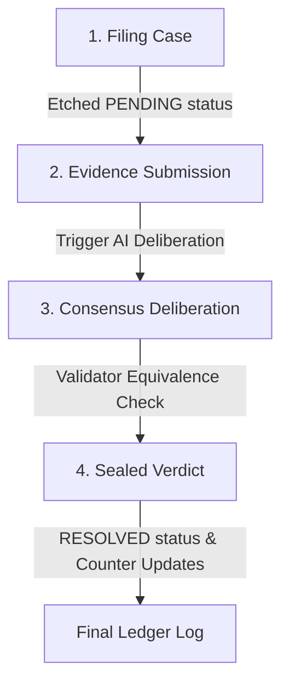

# Genacle: The On-Chain Autonomous Court

Genacle is a decentralized AI arbitration tribunal built entirely on-chain on GenLayer. It provides an autonomous legal protocol to resolve natural-language contract disputes through validator consensus, eliminating central intermediaries and escrow custody risks.

Genacle is currently sitting live at [genacle.vercel.app](https://genacle.vercel.app/), reading and writing to contract [`0xd23D6E7688942FeB5e58aca3f5700b98921E5ACe`](https://explorer-bradbury.genlayer.com/address/0xd23D6E7688942FeB5e58aca3f5700b98921E5ACe) on GenLayer Bradbury.

---

## 1. Protocol Architecture & Workflow

Genacle operates as an autonomous dispute resolution lifecycle that transitions through four distinct phases:



### I. Case Filing
Either party files a new dispute by invoking `file_dispute(title, agreement, claimant_case, respondent_case)`. The contract validates input lengths, increments the sequence counter, sets the state to `PENDING`, and logs the action to the append-only event ledger.

### II. Settlement Evidence
When evidence becomes available (e.g. telemetry logs, code snippets, or API responses), anyone can submit it to `resolve_dispute(dispute_id, evidence)` to trigger the autonomous AI deliberation.

### III. Consensus Deliberation
A leader validator runs the evaluation prompt. Every other validator in the GenLayer network independently re-runs the prompt to verify the leader's proposed verdict, ensuring decentralized judgment.

### IV. Sealed Verdict
If validators reach consensus, the verdict (`CLAIMANT_WIN`, `RESPONDENT_WIN`, or `DISMISSED`) is etched on-chain, updating statistics, and the status changes to `RESOLVED`.

---

## 2. Technical Specification

### Smart Contract (`contracts/genacle.py`)
The tribunal state is managed using GenLayer storage structures optimized to prevent high-gas loops:
* **disputes**: A `TreeMap[str, str]` storing serialized JSON case records keyed by a sequence ID.
* **dispute_ids**: A parallel `DynArray[str]` storing insertion order for paginated view methods.
* **ledger**: An append-only `DynArray[str]` logging historical court actions.
* **Global Statistics**: `total_disputes`, `total_resolved`, and `total_claimant_wins` tracked as `u256` integers to avoid state scans.

### Validator Consensus & Equivalence Rules
AI execution variance is governed inside `validator_fn` using the Equivalence Principle:
1. **Ruling Equivalence**: Rulings must match exactly (`CLAIMANT_WIN`, `RESPONDENT_WIN`, or `DISMISSED`).
2. **Confidence Tolerance**: Validator confidence scores must agree within a custom tolerance range:
   $$\text{Difference} \le \max(20, \frac{20 \times \max(a, b)}{100})$$
3. **Error Alignment**: Expected user errors align under consensus; formatting or LLM failures trigger leader rotation.
4. **Deterministic Backstop**: If a dispute is `DISMISSED`, its confidence is capped at `40%` post-consensus to protect the state against prompt injection or low-trust evidence.

### Real-Time Telemetry Decoding
The frontend polls transaction receipts and decodes the leader's base64-encoded `eq_outputs` from the consensus receipt (`consensus_data.leader_receipt.eq_outputs`). This allows the client to display the leader's draft ruling live on screen while validators are still reviewing and sealing the block.

---

## 3. Developer & Commands Manual

### Contract Quality Control
Run linter checks and local integration tests:
```bash
# Verify contract storage structure
genvm-lint check contracts/genacle.py

# Execute local simulated integration tests
gltest tests/integration/ -v -s --network studionet
```

### Local Frontend Hosting
Launch the Next.js development server:
```bash
cd frontend
npm install --legacy-peer-deps
npm run dev
```

### Bradbury Testnet Operations
Deploy to the live Bradbury testnet:
```bash
# 1. Define private key in .env (template in .env.example)
# 2. Run deployment scripts
python scripts/deploy.py
python scripts/verify_read.py
python scripts/verify_write.py
```

### Static Export Compilation
Build the production static web bundle:
```bash
cd frontend
npm run build
```
The static files will be compiled and prepared for distribution.

---

## 4. Interactive Testing Scenario

To verify the live build and smart contract on GenLayer Bradbury Testnet, you can run a mock software delivery dispute using these copy-paste templates:

### Step 1: File the Case
Click **File Case** in the DApp header and submit these parameters:
* **Dispute Title**: `Freelance React Chart Library Delivery Dispute`
* **Agreement Terms**: `The developer must deliver a custom React charting component supporting SVG animations, responsive scaling, and compatibility with React 19 by June 20, 2026. Payment of 1,200 USDC is locked in escrow, to be released upon successful deployment and inspection of source code.`
* **Claimant's Case Arguments**: `The developer delivered the library, but it uses React 18 legacy refs which crash when rendered in our React 19 environment. The layout is also broken on mobile screens, failing the responsive scaling requirement. We demand a full refund or refactor.`
* **Respondent's Case Arguments**: `The chart library was delivered on time and works perfectly in standard React configurations. The client's React 19 issues are due to their custom build wrappers and Next.js settings, not our codebase. We completed the job and are entitled to the escrow payout.`

### Step 2: Resolve the Case
Find your case on the **Docket Board**, click **Resolve Case**, and paste these mock telemetry logs into the **Evidence** input field:

```text
-- TELEMETRY LOGS & DEPLOYMENT TELEMETRY --
Timestamp: 2026-06-20T14:32:00Z
Deployment URL: https://client-chart-test.vercel.app
Runtime Environment: React 19.2.4, Next.js 16.2.9

Error Console Output:
[React] Error: Ref insertion failed: findDOMNode is deprecated in StrictMode and incompatible with React 19 fiber nodes.
  at ChartContainer (webpack-internal:///./components/Chart.js:42:15)
  at Div (native)

Responsive Layout Telemetry:
Screen Width: 375px (iPhone SE)
Element overflow-x detected: canvas#chart-viewport (Width: 620px) 
Constraint check: FAIL (Responsive width scaling failed)
```

Click **Submit for Deliberation** to sign the transaction. You can then watch the live equivalence and consensus stages update in real time as the decentralized AI validator jurors review the evidence, determine the final ruling, and compile the judicial rationale.

